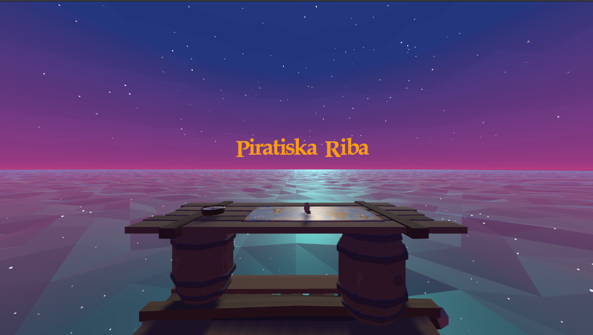
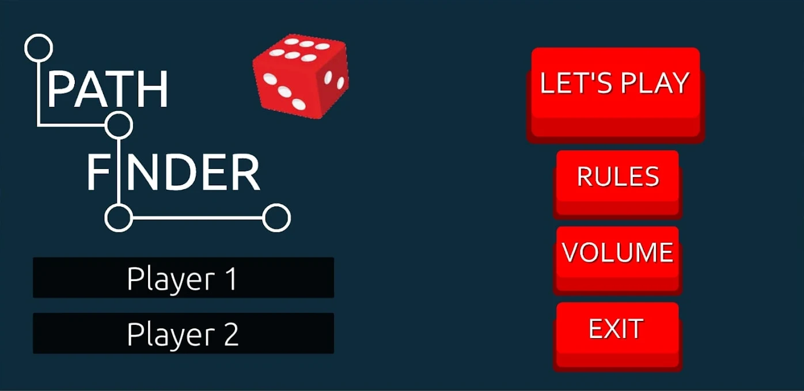

## Portfolio

---

### Projects i worked on 

[Piratiska Riba](https://krugisa.itch.io/piratiska-riba)

 Piratiska Riba is an atmospheric VR puzzle game. There are two Islands: Sad Palm Island and MugiPugi Island. Each beautiful Island has various puzzles and tasks which you need to solve to collect treasure. This beautiful VR game offers you unlimited fun in a VR pirate world.

---
[Pathfinder](http://example.com/)

 Pathfinder is a mobile free-to-play offline board game made for 2 players. Both players draw a path that other player has to find by rolling the dice and trying to guess the path opponent has chosen.

---
[Freak of Nature](https://blenity.itch.io/freak-of-nature)

 "Freak of Nature" is a PvE, FP, horror game set in a hostile and mutated organic environment. You have to explore and use scarce items and weapons at your disposal to survive and complete tasks.

---

